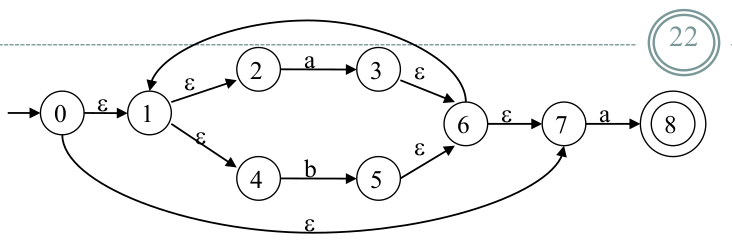

# Compiler Lectures

- [x] [Lecture 1](#lecture-1)
- [x] [Lecture 2](#lecture-2)
- [x] [Lecture 3](#lecture-3)
- [ ] [Lecture 4](#lecture-4) :construction:
- [ ] [Lecture 5](#lecture-5)
- [ ] [Lecture 6](#lecture-6)
- [x] [Other resources](#other-resources)

## Lecture 1

Compiler
: a program that takes a program written in a source language and translates it into an equivalent program in a target language.  

**Techniques** used in compiler design are applicable to many computer science problems.  

| Techniques used in | Can be used in                                                                 |
|:-------------------|:-------------------------------------------------------------------------------|
| lexical analyzer   | text editors,information retrieval system, and pattern recognition programs    |
| parser             | query processing system such as SQL                                            |
| compiler design    | - Natural Language Processing (NLP) <br> - Software having a complex front-end |

### Parts of a Compiler

|                   | Analysis                                                                 | Synthesis                                                                       |
|:------------------|:-------------------------------------------------------------------------|:--------------------------------------------------------------------------------|
| **In this phase** | An intermediate representation is created from the given source program. | The equivalent target program is created from this intermediate representation. |
| **Parts**         | - Lexical Analyzer <br>- Syntax Analyzer <br>- Semantic Analyzer         | - Intermediate Code Generator<br>- Code Generator<br>- Code Optimizer           |

### Phases of a Compiler

From source program to target program, the compiler goes through the following phases.

| Phase                                                       | what happens                                                                                                                                        |
|:------------------------------------------------------------|:----------------------------------------------------------------------------------------------------------------------------------------------------|
| [Lexical Analyzer](#lexical-analyzer)                       | reads the source program character by character and returns the [tokens](#token) of the source program.                                             |
| [Syntax Analyzer](#syntax-analyzer) (parser)                | creates the syntactic structure (generally a parse tree) of the given program.                                                                      |
| [Semantic Analyzer](#semantic-analyzer)                     | checks the source program for semantic errors and collects the type information for the code generation.                                            |
| [Intermediate Code Generator](#intermediate-code-generator) | produces an explicit intermediate codes representing the source program. These intermediate codes are generally machine (architecture) independent. |
| [Code Optimizer](#code-optimizer)                           | optimizes the code produced by the intermediate code generator in the terms of time and space.                                                      |
| [Code Generator](#code-generator)                           | Produces the target language in a specific architecture. The target program is normally is a relocatable object file containing the machine codes.  |

Each phase transforms the source program from one representation into another.  

They communicate with:
- error handlers.
- the symbol table.

### Lexical Analyzer

> - Puts information about identifiers into the symbol table.
> - Regular expressions are used to describe tokens (lexical constructs).
> - A (Deterministic) Finite State Automaton can be used in the implementation of a lexical analyzer.

<p id="token"></p> <!-- for reference to token on phases of a compiler  -->

A Token
: describes a pattern of characters having same meaning in the source program. (such as identifiers, operators, keywords, numbers, delimiters and so on)

Example:  
newval := oldval + 12

| Lexemes | Tokens              |
|:--------|:--------------------|
| newval  | identifier          |
| :=      | assignment operator |
| oldval  | identifier          |
| +       | add operator        |
| 12      | a number            |

### Syntax Analyzer

> Checks whether a given program satisfies the rules implied by a CFG or not. If it satisfies, the syntax analyzer creates a parse tree for the given program.

#### Parse Tree

  
In a parse tree,
* All terminals are at leaves.
* All inner nodes are non-terminals in a CFG.

_syntax of a language_ is specified by a __CFG__ (CFG rules are mostly recursive)  
we use BNF to specify a CFG  

Example:

```
assgstmt   -> identifier := expression
expression -> identifier
expression -> number
expression -> expression + expression
```

*[CFG]: Context Free Grammar
*[BNF]: Backus Naur Form
*[]()* <!-- just to fix the bold thought by the text editor -->

#### Syntax Analyzer :vs: Lexical Analyzer

##### Which constructs recognized by lexical analyzer, and which by syntax analyzer?

- Both of them do similar things; ~~But~~

|            | Lexical Analyzer                                                                                                         | Syntax Analyzer                                                                                                                    |
|:-----------|:-------------------------------------------------------------------------------------------------------------------------|:-----------------------------------------------------------------------------------------------------------------------------------|
| deals with | simple non-recursive constructs of the language                                                                          | recursive constructs of the language                                                                                               |
|            | - simplifies the job of the syntax analyzer <br> - recognizes the smallest meaningful units (tokens) in a source program | works on the smallest meaningful units (tokens) in a source program to recognize meaningful structures in our programming language |

#### Parsing Techniques

|                                       | Top-Down :arrow_down:                                                        | Bottom-Up :arrow_up: (shift-reduce parsing)                                                                                                |
|:--------------------------------------|:-----------------------------------------------------------------------------|:-------------------------------------------------------------------------------------------------------------------------------------------|
| Construction of the parse tree starts | from root towards leaves                                                     | from leaves towards root                                                                                                                   |
| Efficient parsers                     | easily constructed by hand                                                   | created with the help of some software tools                                                                                               |
|                                       | Recursive Predictive Parsing, Non-Recursive Predictive Parsing (LL Parsing). | Operator-Precedence Parsing – simple, restrictive, easy to implement LR Parsing – much general form of shift-reduce parsing, LR, SLR, LALR |

### Semantic Analyzer

> - Type-checking is an important part
- semantic information cannot be represented by a context-free language
- CFGs used in the syntax analysis are integrated with attributes (semantic rules)

The result is a syntax-directed translation (Attribute grammars)  

Example:

```
newval := oldval + 12    
```
` The type of the identifier newval must match with type of the expression (oldval+12)`

### Intermediate Code Generation
> The level of intermediate codes is close to the level of machine codes.

Example:

```
newval := oldval * fact + 1
```

:arrow_down:

```
id1 := id2 * id3 + 1
```

Intermediates Codes :arrow_down: (Quadraples)

```assembly
MULT id2,id3,temp1
ADD temp1,#1,temp2
MOV temp2,,id1
```


### Code Optimizer

```assembly
MULT id2,id3,temp1
ADD temp1,#1,id1
```

### Code Generator

Example:  
(assume that we have an architecture with instructions
whose at least one of its operands is a machine register)

```assembly
MOVE id2,R1
MULT id3,R1
ADD #1,R1
MOVE R1,id1
```

---

## Lecture 2

### Lexical Analyzer:
* It reads the source program character by character to produce tokens.<br>

* Normally a lexical analyzer doesn’t return a list of tokens at one shot, it returns a token when the parser asks a token from it.
<br>

### Tokens:

- Represents a set of strings described by a pattern.
- Additional information should be held for that specific lexeme. This additional information is called as the attribute of the token.
- Token type and its attribute uniquely identifies a lexeme.
- Regular expression is used to specify tokens.
<br>

### Concepts of Languages:

- *Alphabet:* set of finite symbols.
- *String:* sequence of symbols on an alphabet.
- *Language:* consists of set of strings.
- *Operation on Language:*
    - Concatenation
    - Union
    - Exponentiation
    - Kleen Closure "\*"
    - Positive Closure "+"
<br>

### Regular Expressions:

  - Used to describe tokens.
  - Normally, they are built up of simpler regular expressions.
  - *Regular set:* a language denoted by a regular expression.

### Presedence Rules in Regular Expressions:

  1. Parentheses
  2. \* "Kleen Closure"
  3. Concatenation.
  4. \|

### Regular Definition Rules:

* We can give names to regular expressions, and we can use these names as symbols to define other regular expressions.
* A regular definition is a sequence of the definitions of the form:
```
    d1 => r1  
    d2 => r2  
    .  
    dn => rn  
```

*Examples:*

1. Identifiers in Pascal.
```
    letter => A | B | ... | Z | a | b | ... | z  
    digit => 0 | 1 | ... | 9  
    id => letter (letter | digit )*  
```
1. Identifiers in C.
```
    letter => [A-Za-z]
    digit => [0-9]
    CID => letter_(letter_|digit)\*
```
1. Unsigned numbers in Pascal.
```
    digit => 0 | 1 | ... | 9
    digits => digit +
    opt-fraction => ( . digits ) ?
    opt-exponent => ( E (+|-)? digits ) ?
    unsigned-num => digits opt-fraction opt-exponent
```
1. Unsigned numbers or floating point numbers in C.
```
    digit => [0-9]
    digits => digit+
    number => digits(.digits)?(E[+-]? digits)?
```

### Finite Automaton:

- There are two types of FA:
  - *Deterministic:* faster, take more space.
  - *Non-deterministic:* slower, take less space.
- Deterministic is widely used in lexical analyzer.
- To generate DFA we have two ways:
  - Regular Expression => NFA => DFA
  - Regular Expression => DFA

**I. NFA To DFA:**
* NFA may have Ɛ transitions.
* DFA Does not have Ɛ transitions.
* In DFA, for each symbol a and state s, there is at most one labeled edge a leaving s.
<br>

*Thomson's Construction:*
* Used to convert reg. expression to NFA.

  Example:<br>
  

  * We use the generated NFA is converted then to DFA.

  Example:<br>

```
    S 0 = Ɛ-closure({0}) = {0,1,2,4,7}

    Ɛ-closure(move(S0 ,a)) = Ɛ-closure({3,8}) = {1,2,3,4,6,7,8} = S1
    Ɛ-closure(move(S0 ,b)) = Ɛ-closure({5}) = {1,2,4,5,6,7} = S2

    Ɛ-closure(move(S1 ,a)) = Ɛ-closure({3,8}) = {1,2,3,4,6,7,8} = S1
    Ɛ-closure(move(S1 ,b)) = Ɛ-closure({5}) = {1,2,4,5,6,7} = S2

    Ɛ-closure(move(S2 ,a)) = Ɛ-closure({3,8}) = {1,2,3,4,6,7,8} = S1
    Ɛ-closure(move(S2 ,b)) = Ɛ-closure({5}) = {1,2,4,5,6,7} = S2
```



```
    S0 is the start state of DFA since 0 is a member of S0 ={0,1,2,4,7}
    S1 is an accepting state of DFA since 8 is a member of S1 = {1,2,3,4,6,7,8}
```


**II. DFA Direct Conversion:**

* First we augment the given regular expression by concatenating it with a special symbol #.
* Then each alphabet symbol (plus #) will be numbered (without Ɛ).
* Then, we create a syntax tree for this augmented regular expression.
* In this syntax tree, all alphabet symbols (plus # and the empty string) in the augmented regular expression will be on the leaves, and all inner nodes will be the operators in that augmented regular expression.
* Then compute first set of the root and follow set of each character.


  Example:

```
    (a|b) * a         convert it to augmented regular expression.
    (a|b) * a #       then number each alphabet and #

    ( a | b ) * a  #
      1   2     3  4    then create syntax tree
```


```
    first(root) = {1, 2, 3}
    followpos(1)={1,2,3}
    followpos(2)={1,2,3}
    followpos(3)={4}
    followpos(4)={}

    S1 =firstpos(root)={1,2,3}
    a: followpos(1) and followpos(3) = {1, 2, 3, 4} = S2
    b: followpos(2) = {1, 2, 3} = S1

    S2 = {1, 2, 3, 4}
    a: followpos(1) and followpos(3) = {1, 2, 3, 4} = S2
    b: followpos(2) = {1, 2, 3} = S1
```


**DFA Minimization:**
* partition the set of states into two groups:
  * G1: set of accepting states.
  * G2: set of non-accepting states.

* For each new group G:
  * partition G into subgroups such that states s1 and s2 are in the same group if and only if for all input symbols a, states s1 and s2 have transitions to states in the same group.

  Example:

  

```
    G1 = {1, 2, 3}  
    G2 = {4}  

    for G1:
         a   b
    1 => 2   3
    2 => 2   3
    ---
    3 => 4   3

    So, divide G1 into {1, 2} and {3}

    for G2:
         a   b
    4 => 2   3

    Resulting DFA
```


### Issues in Lexical Analyzer:
* The lexical analyzer has to recognize the longest possible string.
* the end of a token is normally not defined
* Normally it doesn’t return a comment as a token. So, the comments are only processed by the lexical analyzer, and the don’t complicate the syntax of the language.

## Lecture 3

## A context-free grammar
> - gives a precise syntactic specification of a programming language.
> - the design of the grammar is an initial phase of the design of a compiler.
> - a grammar can be directly converted into a parser by some tools.

In CFG, we have:

- A finite set of terminals (in our case, this will be the set of tokens)
- A finite set of non-terminals (syntactic-variables)
- A finite set of productions rules in the following form
  ```
  A → α
  ```
  A is a non-terminal    
  α is a string of terminals and non-terminals (including the empty string)
- A start symbol (one of the non-terminal symbol)

Example:

```
E → E + E | E – E | E * E | E / E | - E
E → ( E )
E → id
```

### Parser

> - Works on a stream of tokens(The smallest item is a token).
- Scans input from left to right (one symbol at a time).

Efficient parsers can be implemented only for sub-classes of context-free grammars.  

LL for top-down parsing.  
LR for bottom-up parsing.

### Derivation

> A sequence of replacements of non-terminal symbols

```
E ⇒ E+E
```  
E+E _derives_ from E (we can replace E by E+E)  

In general a derivation step is:   

αAβ ⇒ αƴβ  
if there is a production rule `A → ƴ` in our grammar

|    |       drives in        |
|:--:|:----------------------:|
| ⇒  |        one step        |
| ⇒* |   zero or more steps   |
| ⇒+ | one step or more steps |


### CFG - Terminology

L(G)
: the language of G which is a set of sentences.

sentence of L(G)
: string of terminal symbols of G  


- If S is the start symbol of G then    
ω is a sentence of L(G)  
iff `S ⇒ ω` where ω is a string of terminals of G
- If G is a CFG, L(G) is a context-free
language.
- Two grammars are equivalent if they produce the same
language

S → α  

| α contains non-terminals |   it is called as    |
|:------------------------:|:--------------------:|
|    :heavy_check_mark:    | sentential form of G |
|           :x:            |    sentence of G     |

### Derivation Example


left-most derivation
: If we always choose the left-most non-terminal in each derivation step
```
E => -E => -(E) => -(E+E) => -(id+E) => -(id+id)
```

right-most derivation
: If we always choose the right-most non-terminal in each derivation step
```
E => -E => -(E) => -(E+E) => -(E+id) => -(id+id)
```

At each derivation step, we can choose any of the non-terminal in the sentential form of G for the replacement

- top-down parsers try to find the left-most derivation.
- bottom-up parsers try to find the right-most derivation in the reverse order.

#### Parse Tree & Ambiguity

> can be seen as a graphical representation of a derivation

ambiguous grammar
: produces more than one parse tree for a sentence

unambiguous grammar
: unique selection of the parse tree for a sentence

For  most parsers, **grammar must be unambiguous**.  
ambiguity must be eliminated during the design phase of compiler.  
We have to prefer one of the parse trees of a sentence (generated by an ambiguous grammar) to disambiguate that grammar to restrict to this choice.

```
stmt ⇒ if expr then stmt |
       if expr then stmt else stmt | otherstmts
```
`if E1 then if E2 then S1 else S2`

  
We prefer the second parse tree (else matches with closest if).  
The unambiguous grammar will be:  
```
stmt ⇒ matchedstmt | unmatchedstmt  
matchedstmt ⇒ if expr then matchedstmt else matchedstmt | otherstmts  
unmatchedstmt ⇒ if expr then stmt |
                if expr then matchedstmt else unmatchedstmt
```

### Ambiguity - Operator Presedence
> Ambiguous grammars (because of ambiguous operators) can
be _disambiguated_ according to the precedence and
associativity rules.

disambiguate the grammar precedence:  
`E ⇒ E+E | E*E | E^E | id | (E)`  

^ (right to left)  
\* (left to right)  
\+ (left to right)  

```
E ⇒ E+T | T
T ⇒ T*F | F
F ⇒ G^F | G
G ⇒ id | (E)
```

### Left Recursion

left recursive grammar
: has a non-terminal A such that there is a derivation.

`A ⇒+ Aα ` for some string α  

 > Top-down parsing cannot handle left-recursive grammars.

we have to convert left-recursive grammar to an equivalent NON left-recursive grammar.

immediate left-recursion
: when left-recursion appear in a single step of the derivation

The left-recursion may appear in one or more steps of the derivation.

Example 1:  


---

Example 2:  


> Note that eliminating the **immediate left-recursion**, doesn't mean that the grammar is _NOT_ **left-recursive**.

For example:  


#### Eliminate Left-Recursion -- Algorithm

```algorithm
- Arrange non-terminals in some order: A 1 ... A n
- for i from 1 to n do {
  - for j from 1 to i-1 do {
    replace each production
    Ai -> Aj y
      by
    Ai -> α1 y | ... | αk y
    where Aj -> α1 | ... | αk
  }
  - eliminate immediate left-recursions among Ai productions
}
```
**Example**:
```
S -> Aa | b
A -> Ac | Sd | f

- Order of non-terminals: S, A  
for S:
  - we do not enter the inner loop.
  - there is no immediate left recursion in S.
for A:  
  - Replace A -> Sd with A -> Aad | bd
  So, we will have A -> Ac | Aad | bd | f
  - Eliminate the immediate left-recursion in A
    A -> bdA’ | fA’  
    A’ -> cA’ | adA’ | ε
So, the resulting equivalent grammar which is not left-recursive is:
  S -> Aa | b  
  A -> bdA’ | fA’  
  A’ -> cA’ | adA’ | ε
```

### Left-Factoring

A predictive parser
: a top-down parser without backtracking  
insists that the grammar must be left-factored.  

if we have  
> `A -> α β1 | α β2`

when processing α we cannot know whether expand  
`A to α β1`  
  or  
`A to α β2`

But, if we re-write the grammar as follows  
` A -> αA’ `  
` A’ -> β1 | β2  so, we can immediately expand A to αA’ `

#### Left-Factoring -- Algorithm


##### Example 1

```
A -> abB | aB | cdg | cdeB | cdfB

A -> aA ’ | cdg | cdeB | cdfB
A ’ -> bB | B

A -> aA ’ | cdA ’’
A ’ -> bB | B
A ’’ -> g | eB | fB
```

---

##### Example 2

```
A -> ad | a | ab | abc | b

A -> aA’ | b
A’ -> d | ε | b | bc

A -> aA’ | b
A’ -> d | ε | bA’’
A’’ -> ε | c
```


## Lecture 4

```
Not Added Yet!
```

## Lecture 5

```
Not Added Yet!
```

## Lecture 6

```
Not Added Yet!
```


## Other resources

- Sheet (Answered by [AlaaOthman](//github.com/AlaaOhman)): [on Google Drive](https://drive.google.com/file/d/1yXkSxJLjOUPgtGgFM6gkJSPVtjMLJnhD/view?usp=drivesdk)
- Textbook: [Compilers Principles Techniques And Tools](http://booksdl.org/get.php?md5=346B2177C8F721EE62872DCAF64B9F85)
- TutorialsPoint(videos on YouTube): [Playlist](https://www.youtube.com/playlist?list=PLWPirh4EWFpGa0qAEcNGJo2HSRC5_KMT6)
- TutorialsPoint(written): [Lectures](https://www.tutorialspoint.com/compiler_design/index.htm)
- Udacity: [Programming Languages](https://www.udacity.com/course/programming-languages--cs262)
  - String patterns
  - Lexical Analysis
  - Grammars
  - Parsing
  - Interpreting
  - and more...
