# Computer Architecture Lectures

- [x] [Lecture 1](#lecture-1)
- [x] [Lecture 2](#lecture-2)
- [x] [Lecture 3](#lecture-3)
- [x] [Lecture 4](#lecture-4)
- [x] [Lecture 5](#lecture-5)
- [x] [Lecture 6](#lecture-6)
- [x] [Lecture 7](#lecture-7)
- [x] [Lecture 8](#lecture-8)
- [x] [Lecture 9](#lecture-9)

## Lecture 1

### What is inside a computer?

There are **five** classic components of a computer:
1. **Processor**:
  * Divided into two groups:
    - **Data section (_data path_)**:
        * contains the registers and the Arithmetic Logic unit.
        * is capable of performing certain operations on data items.
    - **Control section**:
        * the control unit that generates control signals that direct the operation of memory and data path.
        * control signals do the following:
          - tell memory to send or receive data.
          - tell the ALU what operation to perform.
          - route data between different parts of the data path.
1. **Registers**:
  * the storage element for data inside the CPU.
  * hold temporary data during calculations.
  * faster in accessing than memory.
1. **Main Memory**:
  * Large collection of circuits, each capable of storing a single bit and is arranged in small cells.
  * Each cell has a unique address
  * Longer strings stored by using consecutive cells.
  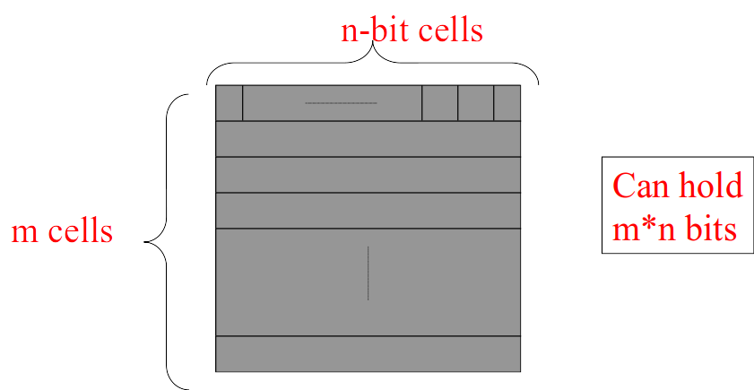
1. **System Bus**:
  * Group of signal lines have the same function.
  * Allow transferring the signals between different parts of the computer and from one device to another.
  * There are **three** types of system buses:
    - _data_ bus:
      * transfers data from CPU to memory and vice-versa.
      * connects I/O ports and CPU.
    - _address_ bus: determines where the address of memory locations should be sent.
    - _control_ bus: determines the operation.
    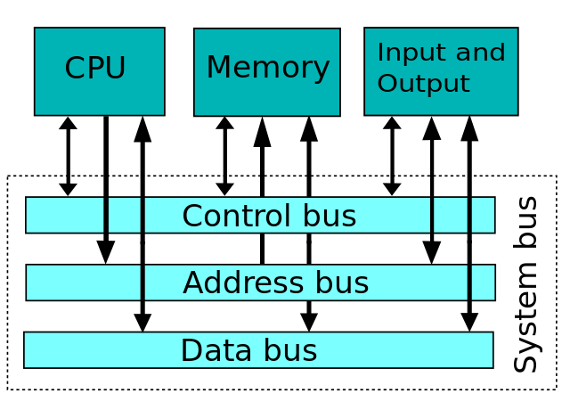


there are two pieces of information that should be known to solve this example:
1. If there are N address lines in address bus, that means we can directly address 2^N of memory locations.
in other words, if we have N address lines, then our memory has 2^N cell.

1. The number of data lines used in the data bus is equal to the
size of data word that can be written or read.

*Example:*

How many memory locations can be addressed by a microprocessor with 14 address lines?

N = 14
then number of memory locations (or memory cells) = 2^N = 2^14 locations.

*Example:*

Suppose that a computer’s Main Memory has 1013 cells. How many address lines are needed in order for all the cells to be usable?

2^N = 1013
then to get N we need to take log for base 2 for both sides
log(2^N) = ceil(log(1013))
N =  9.

---

### Levels of transformation

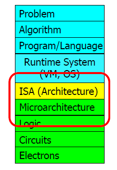
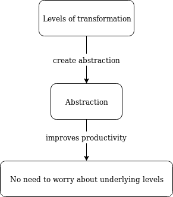  

Abstraction
: A higher level only needs to know about the **interface** to the lower level, _not how the lower level is implemented._


### Convert C program to machine language:

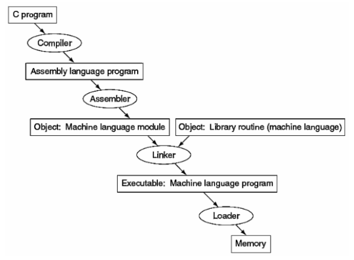

Machine Language
: fundamental instructions expressed as 0s and 1s.

Assembly Language
: human-readable equivalent of machine language.

Assembler
: converts assembly language program to machine language.

Linker
: links separately assembled modules together into a single module suitable for loading and execution.

Loader
: part of operating system responsible for loading executable files into memory and execute them.

### What is computer architecture?

Simply,
>Computer Architecture = Machine organization + Instruction Set Architecture


### Instruction Set Architecture (ISA)
> * Interfaces the software to the hardware
> * provides support for programming.
> * provides the mechanism by which the software tells the hardware what should be done.

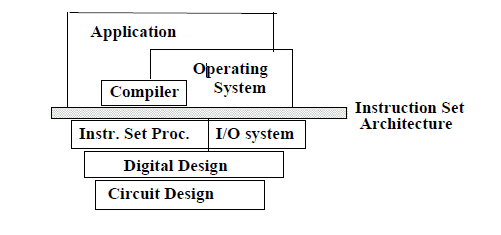

## Lecture 2

### ISA Components
 - Storage cells: registers, memory.
 - Machine Instruction Set: set of possible operations.
 - The instruction format: Size and meaning of fields within the instruction.

**Every instruction need to specify four _(1 which +  3 where)_ things:**
1. Which operation to perform.
1. Where to find the operand or operands, if there are operands.
1. Where to put the result, if there is a result.
1. Where to find the next instruction.

*Example:*  

`MOVE.W D4, D5`  

MOVE => operation  
D4 => location of the operand  
D5 => location to put the result  
Find next instruction => implicitly in the word following this instruction.  


### Instruction Cycle

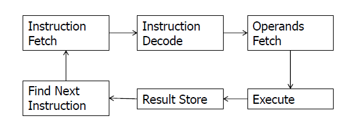

For example, to do the add instruction:

Fetch
: get the instruction from memory into the processor.

Decode
: internally decode what it has to do.

Execute
: take the values from the registers, actually add them together.

Store
: store the result back into another register.(_retiring_ the instruction)

### Classes of instructions

1. _Data movement instructions_: `Load, Store`
1. _Arithmetic and logic_ (ALU) instructions: `Add, Sub, Shift`
1. _Branch_ instructions(control flow instructions): `Br, Brz`

### Program Counter (PC)

* _incremented_ during the _instruction fetch_ to _point_ to the _next instruction_ to be executed.
* controls program flow.

### Branch target address

* A target address is specified in a `branch` or `jump` instruction.
* The target address is loaded into the PC, replacing the address stored there.
* A branch may be:
  - **Unconditional**, as is the C `goto` statement.
  - **Conditional**, depends on whether some condition within the processor state is true or false.

### Condition Code (CC)
> The bit(s) that describe the condition stored in it.
>> also called:
* the processor status word (PSW).
* the status register.

- **No** machine instruction corresponds directly to the conditional statements.

> The approach most machines take is to set various ___status flags___ within the CPU as a result of ALU operations.

- The instruction set contains a number of conditional branch instructions that test various of these flags and then branch or not according to their settings.

### Hypothetical machine models

there are **5** types of them:

|  address instruction  |                                             use                                             |
|:---------------------:|:-------------------------------------------------------------------------------------------:|
| 3 address instruction |                     memory addresses for both operands and the result.                      |
| 2 address instruction |                      overwrites one operand in memory with the result                       |
| 1 address instruction |                 a register **(accumulator)** hold one operand & the result.                 |
| 0 address instruction |              a CPU register **(stack)** to hold both operands and the result.               |
| 4 address instruction | like 3 address but also allows the address of the next instruction to specified explicitly. |

*[ALU]: Arithmetic Logic Unit
*[PSW]: Processor Status Word
*[ISA]: Instruction Set Architecture
*[PC]: Program Counter
*[CC]: Condition Code*

## Lecture 3

for a 2-operand arithmetic instruction we need to specify:
1. The operation to be performed.
1. Location of the 1st operand.
1. Location of the 2nd operand.
1. Place to store the result.
1. Location of next instruction to be performed

- the variation in specifying the five items makes various types of hypothetical machine models.  
- in each machine we study the encoding of an ALU instruction.  


* assume the following:
 - data lines in data bus = 24 => then size of data word = 3 bytes.
 - address lines = 24 => then the size of address of each operand = 3 bytes
 - we have 128 instructions then every instruction is encoded in 7 bit = 8 Byte <!--replace = with approximation sign-->
<!-- make this part as a table -->

|                                                 |                                                       4-address machine                                                       |                                                       3-address machine                                                       |                                                       2-address machine                                                       |                                  1-address machine (accumulator machine)                                  |
|:-----------------------------------------------:|:-----------------------------------------------------------------------------------------------------------------------------:|:-----------------------------------------------------------------------------------------------------------------------------:|:-----------------------------------------------------------------------------------------------------------------------------:|:---------------------------------------------------------------------------------------------------------:|
|                   instruction                   |                                  Operation result operand1 operand2 addressOfNextInstruction                                  |                      specifies only 3 addresses in the list (1st operand, 2nd operand, and the result).                       |                       2 addresses in the list (1st operand, 2nd operand). result in one of the operands                       |                        1 address (1st operand). accumulator (2nd operand, result)                         |
|           bytes for each instruction            |             number of operand's addresses(4) * size of address for each operand(3) + size of opcode(1) = 13 bytes             |            number of operand's addresses(3) * size of address for each operand(3) + size of opcode(1) = 10 bytes.             |             number of operand's addresses(2) * size of address for each operand(3) + size of opcode(1) = 7 bytes.             |   number of operand's addresses(1) * size of address for each operand(3) + size of opcode(1) = 4 bytes.   |
|       memory access to fetch instruction        |                       5 memory accesses => ceil(size of instruction / size of data word) = ceil(13/3).                        |                       4 memory accesses => ceil(size of instruction / size of data word) = ceil(10/3).                        |                        3 memory accesses => ceil(size of instruction / size of data word) = ceil(7/3).                        |              2 memory accesses => ceil(size of instruction / size of data word) = ceil(4/3).              |
|            number of memory Accesses            | 5 (for fetching the instruction) + 2 (for fetching the 1st and 2nd operands) + 1 (for storing the result) = 8 memory accesses | 4 (for fetching the instruction) +  2 (for fetching the 1st and 2nd operands) +1 (for storing the result) = 7 memory accesses | 3 (for fetching the instruction) + 2 (for fetching the 1st and 2nd operands) + 1 (for storing the result) = 6 memory accesses | 2 (for fetching the instruction) + 1 (for fetching one operand or storing the result) = 3 memory accesses |
| PC register handles address of next instruction |                                                              :x:                                                              |                                                      :heavy_check_mark:                                                       |                                                      :heavy_check_mark:                                                       |                                            :heavy_check_mark:                                             |


1. 4-address machine:
  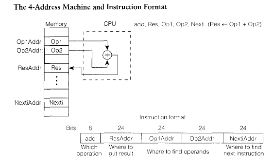  
  *NOTE:* Because of the large instruction word size and number of memory accesses, the 4-address machine and instruction format is not normally seen in machine design.  
1. 3-address machine
  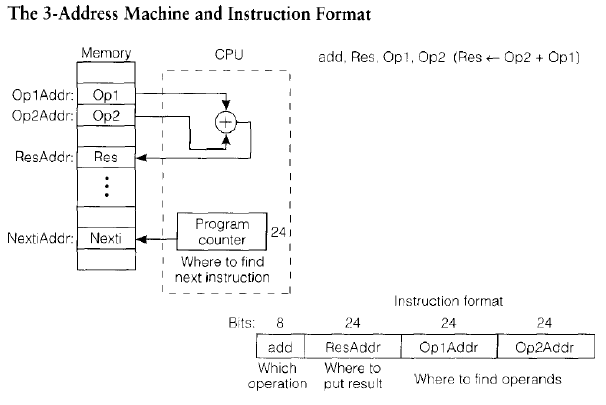
1. 2-address machine
  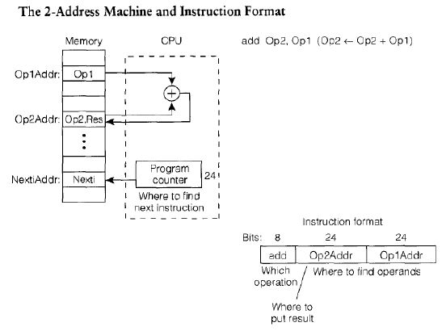
1. 1-address machine (accumulator machine)
  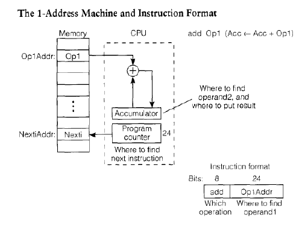
  - Requires two special instructions:
      * LDA Addr; Load the content of Addr to accumulator.
      * STA Addr; Stores the content of accumulator to address Addr.
  - Generally provide a minimum in the size of both program and CPU memory required.


*Example:*

- Assuming that we have only 2^24 memory cells and the width of the data bus is 24 bits.
- Write the code to implement the expression A = B - C*(D+E) on 3-, 2-, and 1- address machines. In accordance with programming language practice, computing the expression should not change the values of its operands.

Solution:
- We have 2^24 memory cells => size of address for any operand = log(2^24) = 24 bits = 3 bytes.
- The width of the data bus is 24 bits => the size of data word = 3 bytes.

A = B - C * ( D + E )

3-address :

| Instruction |       Size       |  Memory Accesses   |
|:-----------:|:----------------:|:------------------:|
| ADD A, D, E | 1+3*3 = 10 bytes | ceil(10/3) + 3 = 7 |
| MPY A, A, C | 1+3*3 = 10 bytes | ceil(10/3) + 3 = 7 |
| SUB A, B, A | 1+3*3 = 10 bytes | ceil(10/3) + 3 = 7 |
|    Total    |     30 bytes     | 21 memory accesses |

2-address :

| Instruction |      Size       |  Memory Accesses   |
|:-----------:|:---------------:|:------------------:|
|  MOV T, D   | 1+3*2 = 7 bytes | ceil(7/3) + 2 = 5  |
|  ADD T, E   | 1+3*2 = 7 bytes | ceil(7/3) + 3 = 6  |
|  MPY T, C   | 1+3*2 = 7 bytes | ceil(7/3) + 3 = 6  |
|  MOV A, B   | 1+3*2 = 7 bytes | ceil(7/3) + 2 = 5  |
|  SUB A, T   | 1+3*2 = 7 bytes | ceil(7/3) + 3 = 6  |
|    Total    |    35 bytes     | 28 memory accesses |

1-address:

| Instruction |     Size      |  Memory Accesses   |
|:-----------:|:-------------:|:------------------:|
|    LDA D    | 1+3 = 4 bytes | ceil(4/3) + 1 = 3  |
|    ADD E    | 1+3 = 4 bytes | ceil(4/3) + 1 = 3  |
|    MPY C    | 1+3 = 4 bytes | ceil(4/3) + 1 = 3  |
|    STA A    | 1+3 = 4 bytes | ceil(4/3) + 1 = 3  |
|    LDA B    | 1+3 = 4 bytes | ceil(4/3) + 1 = 3  |
|    SUB A    | 1+3 = 4 bytes | ceil(4/3) + 1 = 3  |
|    STA A    | 1+3 = 4 bytes | ceil(4/3) + 1 = 3  |
|    Total    |   28 bytes    | 21 memory accesses |


## Lecture 4

5. 0-address machine
  <!-- place image for 0AM  -->
  - An instruction of this machine specifies no address.
  - A stack (of registers) is used as the source of operands and also the destination of the result.
  - For executing the instruction, the operands are popped from the stack and then the result is pushed to it.
  - Requires two special instructions:
      ```
      PUSH Addr; push the content of Addr to the top of stack
      POP Addr; pop the top of the stack and store it in Addr
      ```
  - The address of next instruction is handled by The Program Counter (PC) register.
  - The code to add two memory operands will be like this:
      `Op3 = Op1 + Op2`  
      ```
      PUSH Op1;
      PUSH Op2;
      ADD;
      POP Op3;
      ```
  - Number of bytes required for each instruction:  
     number of operand's addresses(1) * size of address for each operand(3) + size of opcode(1) = 4 bytes.
  - An ALU instruction is encoded in 1 byte.  
   *NOTE:* the instruction is fetched in 2 memory accesses => ceil(size of instruction / size of data word) = ceil(4/3).  
  - Number of memory access:
    2 (for fetching the `push` or `pop` instruction) +
    1 (for fetching one operand or storing the result) = 3 memory accesses
    **OR**
    1 (for fetching ALU instructions) = 1 memory access

*Example:*

- Assuming that we have only 2^24 memory cells and the width of the data bus is 24 bits.
- Assuming that every opcode is encoded in 1 byte

Write the code to implement the expression

A = B - C*(D+E) on 0-address machines. In accordance with programming language practice, computing the expression should not change the values of its operands.

Solution:
- We have 2^24 memory cells => size of address for any operand = log(2^24) = 24 bits = 3 bytes.
- The width of the data bus is 24 bits => the size of data word = 3 bytes.

A = B - C * ( D + E )

0-address :

| Instruction |      Size       |  Memory Accesses   |
|:-----------:|:---------------:|:------------------:|
|   PUSH D    | 1+3*1 = 4 bytes | ceil(4/3) + 1 = 3  |
|   PUSH E    | 1+3*1 = 4 bytes | ceil(4/3) + 1 = 3  |
|     ADD     |     1 bytes     |   ceil(1/3) = 1    |
|   PUSH C    | 1+3*1 = 4 bytes | ceil(4/3) + 1 = 3  |
|     MPY     |     1 bytes     |   ceil(1/3) = 1    |
|   PUSH B    | 1+3*1 = 4 bytes | ceil(4/3) + 1 = 3  |
|     SUB     |     1 bytes     |   ceil(1/3) = 1    |
|    POP A    | 1+3*1 = 4 bytes | ceil(4/3) + 1 = 3  |
|    Total    |    23 bytes     | 18 memory accesses |


6. The General Register machine
  <!-- place image for GRM -->
  - Uses a set of registers to retain intermediate results (for complex operations) inside the CPU. ALU instructions operates on registers.
  - In an instruction, a register is addressed by extra bits (half address):
      N registers requires a code of length log2(N).
      for example: 32 registers are addressed by 5 bits.
  - An ALU instruction usually uses 3 registers.
      for example: ADD R2, R4, R6; => R2 = R4+R6
  - An instruction that specifies one operand in memory and one operand in a register are known as a 1½ address instruction.
  - Assuming that there are 32 general-purpose registers => then each register reference requires 5 bits to specify 1 of the 32 registers.
  - Number of bytes required for 3-register add instruction:
     number of operand's addresses(3) * size of address for each operand(5) + size of opcode(8) = 23 bits.  
     That means the instruction is fetched in 1 memory accesses => ceil(size of instruction / size of data word) = ceil(23 bits/24 bits).

  - Number of memory accesses required for 3-register add instruction:
    1 (for fetching the instruction).
    *NOTE:* There is no memory accesses for operands.

  - Number of bytes required for load instruction:
    5 bits for the register +
    24 bits for memory address of the operand +
    8 bits for the operation = 37 bits
    That means the instruction is fetched in 2 memory accesses => ceil(size of instruction / size of data word) = ceil(37 bits/24 bits).

    - Number of memory accesses required for load instruction:
      2 (for fetching the instruction) +
      1 (for fetching the operand) = 3 memory accesses.


*Example:*
  Consider a General Register Machine that includes 32 general purpose registers. Assume that every opcode is encoded in 1 byte, the memory is addressed by 24 bits and the width of the data bus is 24 bits.

  1. Write the assembly code to implement the expression A = ( B + C ) * ( D + E ) on the above machine.
  2. Compute the memory size (in bytes) required for the code in (1).
  3. Compute the number of memory accesses required to execute the expression (1) on the specified machine.

  Solution:
  - The machine includes 32 general purpose registers => size of address of register = 5 bits
  - Size of address for any operand in memory = 24 bits
  - The width of the data bus is 24 bits => the size of data word = 24 bits.


|  Instruction   |          Size           |   Memory Accesses   |
|:--------------:|:-----------------------:|:-------------------:|
|   LOAD R1, B   |  8 + 5 + 24 = 37 bits   | ceil(37/24) + 1 = 3 |
|   LOAD R2, C   |  8 + 5 + 24 = 37 bits   | ceil(37/24) + 1 = 3 |
| ADD R1, R1, R2 | 8 + 5 + 5 + 5 = 23 bits |   ceil(23/24) = 1   |
|   LOAD R3, D   |  8 + 5 + 24 = 37 bits   | ceil(37/24) + 1 = 3 |
|   LOAD R4, E   |  8 + 5 + 24 = 37 bits   | ceil(37/24) + 1 = 3 |
| ADD R3, R3, R4 | 8 + 5 + 5 + 5 = 23 bits |   ceil(23/24) = 1   |
| MPY R1, R1, R3 | 8 + 5 + 5 + 5 = 23 bits |   ceil(23/24) = 1   |
|  STORE A, R1   |  8 + 24 + 5 = 37 bits   | ceil(37/24) + 1 = 3 |
|     Total      |        245 bits         | 18 memory accesses  |


* Trade-offs in instruction types:
  - The 3-address machines have the shortest code sequences but require large number of bits per instruction.

  - The 0-address machines have the longest code sequences and require small number of bits per instruction.

  - Even in 0-address machines there are 1-address instructions, push and pop.

  - General register machines can use 3-address instructions with small instruction size by using 2 register operands and 1 memory address.

## Lecture 5

**Effective address:** To access an operand in memory, the CPU must first compute its address, this address is called effective address.
- This address is then issued to the memory subsystem.

**Addressing modes:**
- There are seven ways to compute the effective address:
  1. Immediate addressing
  2. Direct addressing
  3. Indirect addressing
  4. Register direct addressing
  5. Register indirect addressing
  6. Displacement (based or indexed) addressing
  7. Relative addressing

---

1. Immediate addressing:
  - Is used to access constants stored in the instruction.
  - It supplies an operand immediately without computing an address.
<!-- place image for IA -->

2. Direct addressing:
  - The address of the operand is specified as a constant in the instruction.
  <!-- place image for DA -->

3. Indirect addressing:
  - In indirect addressing, a constant in the instruction specifies not the address of the value, but the address of the address of the value.
  - The indirect addressing is used in implementing pointers.
  - Two memory accesses are required to access the value:
      * fetching the pointer, which is stored in memory;
      * having that address, the CPU accesses the value stored at that address.
      <!-- place image for IDA -->

4. Register Direct addressing:
  - In the register direct mode, the operand is contained in the specified register.
  <!-- place image for RDA -->

5. Register Indirect addressing:
  - This addressing mode is used to sequentially access the elements of an array stored in memory:
      * The starting address of the array is stored in a register,
      * an access is made to the current element, then the register is incremented to point to the next element.
      <!-- place image for RIDA -->

6. Displacement (Indexing) addressing:
  - The memory address is formed by adding a constant contained within the instruction, to the address value contained in a register.
  - Used to access C structs or Pascal Records.
  <!-- place image for DisA -->

7. Relative addressing:
  - Similar to indexed, but the base address is held in the PC rather than in another register.
  - Allows the storage of memory operands at a fixed offset from the current instruction.
  <!-- place image for RA -->

#Lecture 6

**Classification of ISAs:**
 - The architectural designs of CPU are
    * RISC (Reduced instruction set computing).
    * CISC (Complex instruction set computing).

***RISC:*** is a computer which only uses simple commands that can be divided into several instructions which achieve low-level operation within a single CLK cycle.

***CISC:**** is a computer where single instructions can perform numerous low-level operations like a load from memory, an arithmetic operation, and a memory store. Or are accomplished by multi-step processes or addressing modes in single instructions.

**Simple Risc Computer (SRC):**
  - 32-bit general purpose registers.
  - PC (Program Counter Register): holds the next instruction.
  - IR (Instruction Register): is the part of a CPU's control unit that holds the instruction currently being executed or decoded.
  - 32-bit words (4 bytes) can be fetched or stored.
  - Contains 2^32 Bytes of memory.
  - Memory addresses ranges from 0 to 232 -1.

<!-- place image of Programmer's Model of the SRC -->

**Instruction Formats:**
  - Arithmetic instructions: There are four arithmetic instructions: add, addi, sub, and neg.
  - Logical and shift instructions: There are nine logical and shift instructions: and, andi, or, ori, not, shr, sha, shl, and shc.
  - Miscellaneous instructions: There are two zero-operand instructions: nop and stop.
  - Load and store instructions: There are four load instructions Id, Idr, la, and lar, and two store instructions st and str.
  - Branch instructions: There are two branch instructions, br and brl.
  - All instructions are 32 bits long.
  - All instructions have a 5-bit opcode field, allowing 32 different instructions.
  - The ra, rb, and rc fields are 5-bit fields that specify one of the 32 general purpose registers.
  - Constants cl, c2, c3.
  - The notation M[x] means the value stored at word x in memory.

1. Accessing Memory: The Load and Store Instructions
  - The load and store instructions are the only SRC instructions to access operands in memory.
<!-- place image of examples  -->

*Example:*
Encode the instruction ld r22, 24(r4).
the opcode for ld = 1.

Solution:

the instruction means:
```
  R[r22] = M[24 + R[r4]];
  ld = 1
  ra = 22
  rb = 4
  c = 24
    1      22     4           24
  00001  10110  00100  00000000000011000
```
2. Arithmetic and Logic Instructions:
  - The instruction neg (op = 15): takes the 2's complement of the contents of register R[rc] and stores it in register R[ra].
  - The not (op = 24) instruction: takes the logical (1's) complement of the contents of register R[rc] and stores it in register R[ra].

  * Review: (1's) complement
  <!-- place image  -->
  * Review: (2's) complement
  <!-- place image  -->

  There are two types of ALU instructions:
    * Register ALU Instructions: add, sub, and, or.
    * Immediate Addressing ALU Instructions: addi, andi, ori.

    Add: adds the value in two registers.
    Addi: adds an immediate value (constant) to the register.

3. Miscellaneous Instructions
  - nop (op = 0), whose purpose is to do nothing. it is used as a time waster.
  - stop (op = 31), whose purpose is to halt the machine.

## Lecture 7
  - This lecture concerned with the fetch, decode, execute, store instruction cycle in more details.
  - General Concepts:
    * The program counter (PC): is pointing to the next instruction to be executed.
    * Memory Address Register (MAR): is the CPU register that either stores the memory address from which data will be fetched for the CPU, or the address to which data will be sent and stored. In other words, MAR holds the memory location of data that needs to be accessed.
    * Memory Data Register (MDR) or Memory Buffer Register (MBR): is the register of a computer's control unit that contains the data to be stored in the computer storage (e.g. RAM), or the data after a fetch from the computer storage.
    * Instruction register (IR) or current instruction register (CIR): is the part of a CPU's control unit that holds the instruction currently being executed or decoded.
  - This video illustrates the phases in depth with more details.
  https://www.youtube.com/watch?v=jFDMZpkUWCw

## Lecture 8

4. Shift instructions: Shift the operand in R[rb] right, or left," from 1 to 32 bits,
and place the result in R[ra].
- The amount of the shift is governed by an encoded 5-bit unsigned integer, so shifts from 0 to 31 bits are possible.
- The integer representing the shift count is stored as an immediate value in the 5 least significant bits in the instruction.
- for example: shr shifts zeros in from the left as the value is shifted right.

5. Branch Instructions:
<!-- place image of the table -->

## Lecture 9

**Instruction Processing “Cycle”:**
  - Instructions are processed under the direction of a “control unit” step by step.
  - Instruction cycle: Sequence of steps to process an instruction
  - Fundamentally, there are six phases:
    1. Fetch
    2. Decode
    3. Evaluate Address
    4. Fetch Operands
    5. Execute
    6. Store Result
  - Not all instructions require all six phases

**Instruction Processing “Cycle” vs. Machine Clock Cycle:**
1. Single-cycle machine: All six phases of the instruction processing cycle take a single machine clock cycle to complete.
  - All state updates made at the end of an instruction’s execution.
  - Big disadvantage: The slowest instruction determines cycle time, Therefore, long clock cycle time.
<!-- place image of SCM -->
2. Multi-cycle machine: All six phases of the instruction processing cycle can take multiple machine clock cycles to complete.
  - In fact, each phase can take multiple clock cycles to complete
  - Instruction processing broken into multiple cycles/stages
  - State updates can be made during an instruction’s execution
  - Architectural state updates made only at the end of an instruction’s execution
  - Advantage over single-cycle: The slowest “stage” determines cycle time.
  <!-- place image of MCM -->

**Single-cycle vs. Multi-cycle:
Control & Data**
                                  control                               data
Single-cycle machine:       Control signals are generated        Everything related to an instruction
                            in the same clock cycle as the       happens in one clock cycle (serialized
                            one during which data signals        processing)
                            are operated on.

Multi-cycle machine:        Control signals needed                Latency of control processing can be
                            in the next cycle can be              overlapped with latency of datapath
                            generated in the current cycle        operation (more parallelism)

**Performance of Computer Systems:**
- *Response time:* the time between the start and the completion of a task (in time units)
- *Throughput:* the total amount of tasks done in a given time period (in number of tasks per unit of time)

- The computer user is interested in response time (or execution time) – the time between the start and completion of a given task (program).
- The manager of a data processing center is interested in throughput – the total amount of work done in given time.
- The computer user wants response time to decrease, while the manager wants throughput increased.

**CPU Time or CPU Execution Time:**
CPU time (or CPU Execution time) is the time between the start and the end of execution of a given program.

- This time accounts for the time CPU is computing the given program, including operating system routines executed on the program’s behalf.
- It does not include the time waiting for I/O and running other programs.
- CPU time is a true measure of processor/memory performance.

**Analysis of CPU Time:**

CPU time depends on the program which is executed, including:
- the number of instructions executed,
- types of instructions executed and their frequency of usage.

**Clock rate:**
- refers to the frequency at which a chip like a central processing unit (CPU) is running and is used as an indicator of the processor's speed
- is given in Hz (=1/sec).
- defines duration of discrete time intervals called clock cycle times or clock cycle periods:
      clock_cycle_time = 1/clock_rate (in sec)

<!-- place table of units -->


*Example:*
A processor having a clock cycle time of 0.25 nsec will have a clock rate of …….
- 1000MHz
- 2000MHz
- 3000MHz
- **4000MHz**

Solution:
  Clock cycle time C is the reciprocal of the clock rate f:
  C = 1 / f
  f= 1/C = 1/0.25ns = 4 GHz or 4000 MHz

**CPU Time Equation:**
  CPU time = Clock cycles for a program * Clock cycle time
           = Clock cycles for a program / Clock rate
           = Instruction count * CPI / Clock rate
- Clock cycles for a program is a total number of clock cycles needed to execute all instructions of a given program.
- Instruction count is a number of instructions executed, sometimes referred as the instruction path length.
- CPI – the average number of clock cycles per instruction
    CPI = Clock cycles for a program / Instructions count


Single cycle microarchitecture performance:
- CPI = 1
- Clock cycle time = long

Multi-cycle microarchitecture performance:
- CPI => different for each instruction
- Average CPI => small
- Clock cycle time => short
