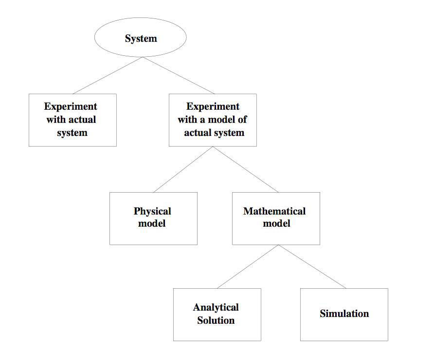
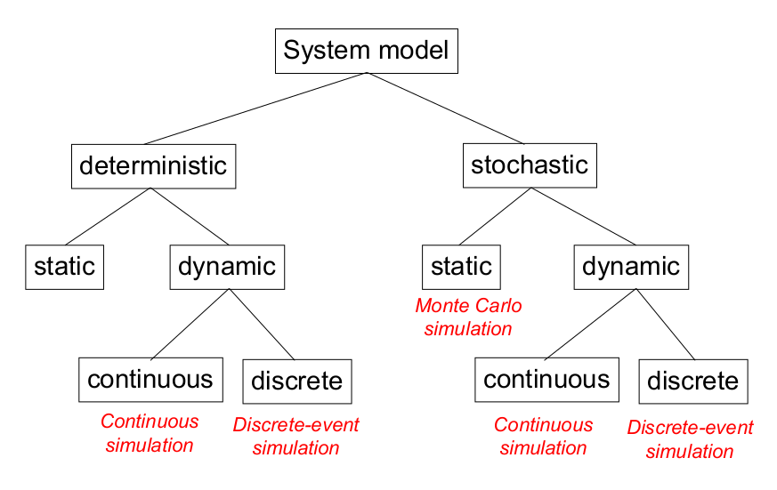
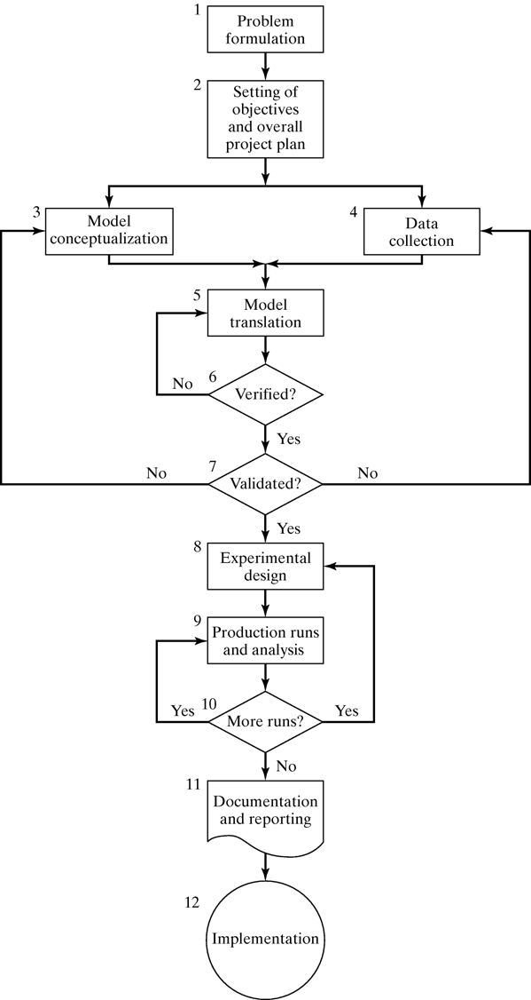

# Simulation Lectures

- [x] [Lecture 1](#lecture-1)
- [x] [Lecture 2](#lecture-2)
- [x] [Lecture 3](#lecture-3)
- [x] [Lecture 4](#lecture-4)
- [ ] [Lecture 5](#lecture-5) :construction:
- [ ] [Lecture 6](#lecture-6)

# Lecture 1

## Systems and System Environment:

* System is defined as a groups of objects that are joined together in some regular interaction toward the accomplishment of some purpose.
  - For example: An automobile factory: Machines, components parts and workers operate jointly along assembly line.

* System environment: changes occurring outside the system.
  - Factory : arrival orders
  - Banks : arrival of customers

## Components of a System:

* **Entities:** Elements that often make up the system.
* **Attribute:** A property of an entity.
* **Activity:** represents a time period of specified length.
* **State of system:** is defined to be that collection of variables necessary to describe the system at any time, relative to the objective of the study.
  - In the study of a bank possible state variables are number of busy tellers, number of customers waiting in the queue or being served, arrival and service times of the next customer.
* **Event:** is defined as an instantaneous occurrence that may change the state of the system.
* **Endogenous** – used to describe the activities and events occurring within a system.
* **Exogenous** – is used to describe activities and events in the environment that affect the system.
  - In the bank: arrival of a customer is exogenous event completion of service of a customer is endogenous event.

## Examples on components of a system:

* Banking System

|  Entites  | Attributes  |                  Activities                  |         Events          |                        State variables                        |
|:---------:|:-----------:|:--------------------------------------------:|:-----------------------:|:-------------------------------------------------------------:|
| Customers | the balance | making deposits in their checking  accounts. | arrival,  departure. | number of busy tellers,  arrival time of the next customer |

* Rail System

|  Entites  |        Attributes        | Activities |                   Events                   |                                State variables                                |
|:---------:|:------------------------:|:----------:|:------------------------------------------:|:-----------------------------------------------------------------------------:|
| Commuters | Origination, Destination | Traveling  | arrival at station, arrival at destination | Number of commuters waiting at each station, number of commuters traveling |

* Production System

| Entites  |            Attributes            |         Activities         |  Events   |             State variables             |
|:--------:|:--------------------------------:|:--------------------------:|:---------:|:---------------------------------------:|
| Machines | Speed , Capacity, Breakdown rate | Welding, Cutting, Stamping | breakdown | Status of machines – busy, idle or down |

* Communications System

| Entites  |      Attributes      |  Activities  |         Events         |               State variables                |
|:--------:|:--------------------:|:------------:|:----------------------:|:--------------------------------------------:|
| Messages | Length , Destination | Transmitting | arrival at destination | Number of messages waiting to be transmitted |

## Ways to study a system:

Simulation
: is the imitation of the operation of real-world process or system over time.

* A model construct a conceptual framework that describes a system.
* Simulations involve designing a model of a system and carrying out experiments on it as it progresses through time.

## Goal of modeling and simulation:

* A model can be used to investigate a wide verity of “what if” questions about real-world system.
* Simulation can be used as:
  - Analysis tool for predicating the effect of changes.
  - Design tool to predicate the performance of new system.
* It is better to do simulation before implementation.

## Reason for using a model:

1. Helps in understanding the behavior of a real system before it is built.
2. Cost of building and experimenting with a model is less.
3. Models have the capability of scale time or space in favorable manner.

<!-- make the next two points as a table -->

## When Simulation Is Appropriate:

* Simulation enables study of internal interaction of subsystems in complex system.
* Simulation can be used with new design and policies before implementation.
* Simulation models are designed for training make learning possible without cost disrupting.

## When Simulation Is Not Appropriate:

* When the problem can be solved by common sense.
* If it is easier to perform direct experiments.
* If cost exceed savings.
* If resource or time are not available.
* If system behavior is too complex like human behavior

<!-- make the next two points as a table -->

## Advantages of simulation:

* New policies, operating procedures, information flows and so on can be explored without disrupting ongoing operation of the real system.
* Time can be compressed or expanded to allow for a speed-up or slow-down of the phenomenon (clock is self-control).
* A simulation study can help in understanding how the system operates.
* “What if” questions can be answered.

## Disadvantages of simulation:

* Model building requires special training.
* Vendors of simulation software have been actively developing packages that contain models that only need input (templates).
* Simulation results can be difficult to interpret.
* Simulation modeling and analysis can be time consuming and expensive.

## Areas of application:

1. Semiconductor Manufacturing.
2. Military application.
3. Transportation modes and Traffic.
4. Business Process Simulation.
5. Health Care.
6. Risk analysis.
7. CPU, Memory.
8. Network simulation.

## How to simulate:

1. By hand.
2. Spreadsheets
3. Programming in General Purpose Languages => Java.
4. Simulation Languages => SIMAN.
5. Simulation Packages => Arena.

## Types of Models:

* All models can be grouped into three types:
  1. Graphic models:
    - Conceptual drawings, graphs, charts, and diagrams.
    - Football coaches develop them to show how players (components) should interact during an offensive or defensive play (system).

  2. Mathematical models:
    - Show relationships in terms of formulas.
    - complex mathematical models track storms and space flights, predict ocean currents and land erosion, and help scientists conduct complex experiments.

  3. Physical models:
    - three-dimensional representations of reality => (Model Airplane, Model House, Model City).
    - Two types of physical models exists:
      1. Mock-up: is used to evaluate the styling, balance, color, or other aesthetic feature of a technology artifact.
      - Mock-ups are generally constructed of materials that are easy to work with => wood, clay, Styrofoam, paper, and various kinds of cardboard.
      2. Prototype: is a working model of a system.
      - Prototypes are built to test the operation, maintenance,
      and/or safety of the item and is built of the same material as the final product.

## Types of Models:

* Dynamic :vs: Static
* Stochastic :vs: Deterministic
* Discrete :vs: Continuous

## Characterizing a Simulation Model:

|                      |                      Deterministic                       |    Stochastic (NON-DETERMINISTIC or PROBABILISTIC)     |
|:--------------------:|:--------------------------------------------------------:|:------------------------------------------------------:|
| **Random variables** |             No random variable in the model.             |   model has one or more random variables as inputs.    |
|     **Behavior**     |                 behavior is predictable.                 |             behavior cannot be predicted.              |
|     **Example**      | Clinic: patients arriving at scheduled appointment time. | Bank: random customer inter-arrival and service times. |

 

|                       Static                       |                                                                     Dynamic                                                                     |
|:--------------------------------------------------:|:-----------------------------------------------------------------------------------------------------------------------------------------------:|
|                  No time element.                  |                                                   Passage of time is important part of model.                                                   |
|        Time Independent view of the system.        |                                                       Time dependent view of the system.                                                        |
| e.g. Class has same number of students in an year. | E.g. ATM can accept card only when it is in ready state. ATM cannot read card when it is in ERROR state. Thus state of ATM is a dynamic aspect. |

 

|                                            Discrete system                                            |                               Continuous system                                |
|:-----------------------------------------------------------------------------------------------------:|:------------------------------------------------------------------------------:|
| state variables change only at discrete set of points in time (a countable number of points in time). | the state variables change continuously over time (infinite number of states). |

## How to develop a model?

1. Determine the goals and objectives.
2. Build a conceptual model.
3. Convert into a specification model.
4. Convert into a computational model.
5. Verify.
6. Validate.

## Three Model Levels:

1. Conceptual:
  - Very high level
  - How comprehensive should the model be?
  - What are the state variables, which are dynamic, and which are important?

2. Specification:
  - On paper
  - May involve equations, pseudocode, etc.
  - How will the model receive input?

3. Computational:
  - A computer program.
  - simulation language.

## Steps in Simulation Study:

# Lecture 2

All of it is just section problems.

# Lecture 3

* Problem formulation is the most important step in a simulation study. It have a significant impact on the success of the simulation study.
* The first step in simulation project is to ensure that adequate attention has been directed toward understanding what is to be accomplished by performing the study.
* Problem formulation process consist of:
  1. A formal problem statement
  2. Orientation of the system
  3. Establishment of specific project objectives

**1. Formal Problem Statement:**
  - Goal: provide both the practitioner and the potential audience with a clearly understandable high-level justification for the simulation.
  - The goal including:
    1. Increasing customer satisfaction.
      - is of fundamental interest in any system involving service operations.
      - This type of system typically includes waiting or processing queues.
      - Reductions in queue time usually result in increased customer satisfaction.
      - Reductions in the number of late jobs will reduce operating costs and will increase customer satisfaction.

    2. Increasing throughput.
      - involves the amount of products or number of jobs that can be processed over a given period of time.
      - This can involve the elimination or improvement of different process operations.
      - It can also include the identification and redesign of bottleneck processes.

    3. Reducing waste.
      - Reducing waste results in reduced operating costs and increased net profits.
      - Waste can be reduced through reductions in damage and old-fashion.
      - damage can involve processes that are time and temperature critical.
      - old-fashion waste can result from an organization’s to bring its product to the market on time.

    4. Reducing work in progress.
      - Work in progress is work that requires further processing for completion.
      - Work in progress is commonly found in processes that require multiple discrete operations.
      - Work in progress typically requires storage before the next process can be carried out.
      - Reducing work in progress reduces process costs associated with resource capacity and storage requirements.

## Tools for Developing the Problem Statement:

* There are two common tools available to the practitioner for
assisting with the problem statement:
  1. Fishbone / Cause-Effect / Ishikawa Chart:
    - The purpose of this chart is to identify the cause of the problem or effect of interest.
    - The head of the fish is labeled with the problem or effect.
    - When the Fishbone diagram is complete, the practitioner can concentrate on the most important sources or causes of the problem.

  2. Pareto Chart:
    -  Only a few factors are the cause of many problems. This is frequently referred to as the 80–20 rule: 80% of the problem is caused by 20% of the factors.

**2. Orientation of the system:**
  * Goal: The practitioner’s familiarizing himself or herself with the system.
  * Orientation Process/Types:
    1. Initial orientation visit:
      - Goal: To obtain a high-level understanding of the basic inputs and outputs of the system.
    2. Detailed flow orientation visit:
      - Goal: An understanding of how the system operates.
    3. Review orientation visit
      - Goal: To ensure that the understanding of the system operation is consistent with the practitioners’ understanding of the system and/or flow chart.

**3. Project Objectives:**

* Common project objectives may involve
  1. Performance-related operating policies
  2. Performance-related resources policies
  3. Cost-related resource policies
  4. Equipment capabilities evaluation

# Lecture 4

## Project Management Concepts:

1. Project parameters, standard measurements:
  * Time:
    - Associated with the project schedule, which is implemented as a Gantt chart.
    - If there are significant differences between the actual project progress and the project schedule, something may be incorrect .
    -  If the project is continuously ahead of schedule, the following situations may exist:
      - The budget is being consumed at an excessive rate.
      - Excess resources are assigned to the project.
      - The project is much less complex than originally estimated.
    - if the project is continuously behind schedule, any of the following situations may be present:
      - Expenditures are being delayed.
      - Insufficient resources are assigned to the project.
      - The project is much more complex than originally estimated.

  * Cost:
    - The cost parameter means that there is a budget associated with the project.
    - Simulation project costs may include computer hardware and software.
    - The budget is perhaps the most easily tracked project parameter.
    - In the event that the project is continuously under budget, the following situations may be present:
      - Expenditures are being delayed.
      - Insufficient or inexperienced resources are assigned to the project.
      - The project is much smaller or less complex than originally estimated.
    - Problems may also exist if the project is continuously over budget, Typical causes are:
      - The budget is being consumed at an excessive rate.
      - Excess resources are assigned to the project.
      - The project is much larger or more complex than originally estimated.

  * Technical performance:  
    - Specified in the problem statement phase of the project.
    - The project must achieve these objectives in order to be considered successful from a technical performance standpoint.

2. Project life cycles, common phases:
  * Conceptual:
    - During this phase, the organization will formally assign the project to the project manager.
    - The problem formulation process may be completed during this life cycle phase.

  * Planning:
    - During the planning phase, the project manager will identify all of the project team members.
    - The simulation-planning process activities involving the work breakdown structure, linear responsibility chart, and Gantt chart are conducted during this life-cycle phase.

  * Execution:
    - Most of the simulation project activities for the project will be completed.
    - These activities include:
      the system definition,
      input data collection and analysis,
      model translation,
      verification,
      validation,
      experimentation, and analysis.

  * Completion:
    - Turning over the results of the project and primarily include the simulation project report.

3. Project stakeholders
  * Internal stakeholders:
    - Individuals who are directly associated with the simulation project team => (Practitioner/project manager, Analysts, Statisticians, Data collectors).

  * External stakeholders:
    - Individuals or organizations who are not directly associated with the simulation project team.

  * Stakeholder strategy

## Simulation Project Manager Functions:

* There are five generally accepted project manager functions that will affect the success or failure of the simulation project:

1. Planning:
  - This process includes the development of a work breakdown   structure and a Gantt chart.
  - A work breakdown structure is the successive division of project tasks to the point that individual responsibility and accountability can be assigned.
  - A Gantt chart illustrates the duration and relationships among the work breakdown structure tasks.

2. Organizing:
  - identifying, acquiring, and aligning the simulation project team.
  - The relationship between the host organizations and the different projects that the team members are assigned can be clarified through the use of a matrix organizational chart.

3. Motivating
4. Directing
5. Controlling
  - The control process consists of:
    * Setting project standards
    * Observing performance
    * Comparing the observed performance with the project standards
    * Taking corrective action

## Developing the Simulation Project Plan

* The project-planning process as a minimum consists of developing:
  - A work breakdown structure (WBS)
  - A linear responsibility chart (LRC)
  - A Gantt chart:
    * Common relationships:
      - Start-to-Start: This sort of situation may occur when a single previous process splits into two different tasks that must be worked on simultaneously.
      - Finish-to-Finish: is found when both tasks are desired to be completed at the same time.
